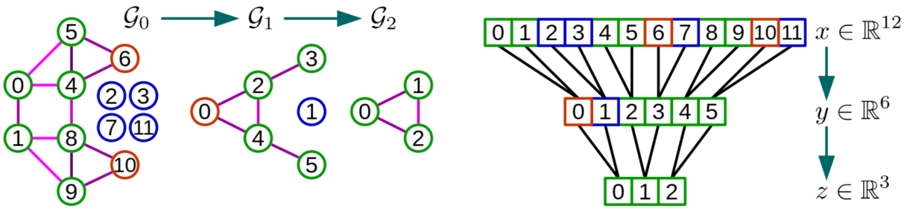
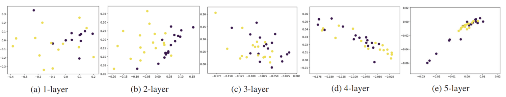
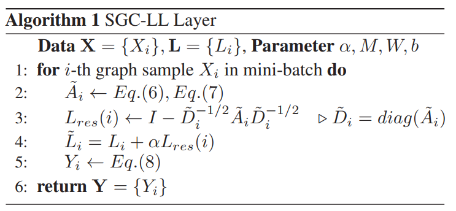
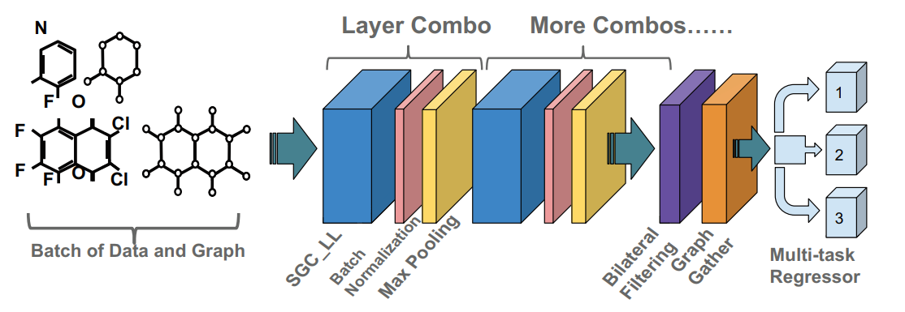
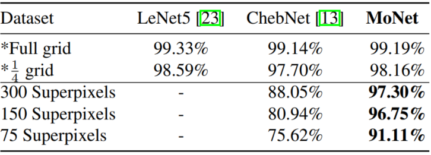
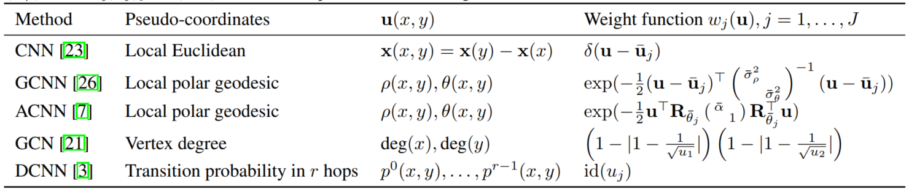
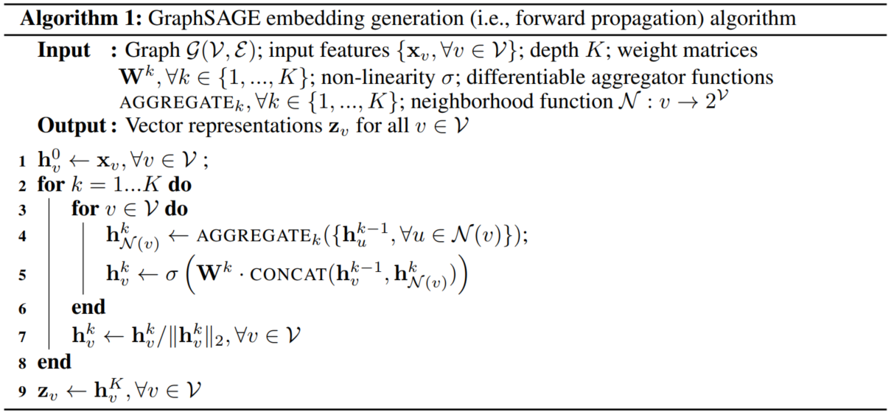

# GCN相关的基础文献
图卷积网络是针对于图结构数据的有力分析工具，这四篇文章是图卷积网络领域内比较重要的基础性工作，对于我们理解和使用图卷积网络有着很重要的意义
## 目录
* [谱视角(Spectral method)](#谱视角)
    * [before deep learing graph neural network--图卷积](#图卷积)
    * [convolutional neural networks on graphs with fast localized spectral filtering--图卷积的快速计算](#图卷积的快速计算)
    * [Semi-supervised classification with graph convolutional network-iclr2017--一阶近似与半监督学习](#一阶近似与半监督学习)
    * [Deeper insights into graph convolutional networks for semi-supervised learning aaai2018](#deeper-insights)
    * [Diffusion convolutional recurrent neural network Data-driven traffic forecasting--扩散卷积](#扩散卷积)
    * [Adaptive Graph Convolutional Neural Networks AAAI2018--根据输入动态变化的拉普拉斯矩阵](#根据输入动态变化的拉普拉斯矩阵)
    * [Fastgcn fast learning with graph convolutional networks via importance sampling iclr2018--采样与推断式的学习](#采样与推断式的学习)
* [空间视角(spatial method)](#空间视角)
    * [Geometric deep learning on graphs and manifolds using mixture model CNNs CVPR2017--一般化的框架](#一般化的框架)
    * [Inductive Representation Learning on Large Graphs--推断式的图卷积](#推断式的图卷积)
    * [Structure-Aware Convolutional Neural Networks NIPS2018--具备局部拓扑结构感知能力的图卷积](#具备局部拓扑结构感知能力的图卷积)
    * [Graph attention networks ICLR2018--注意力机制的引入](#注意力机制的引入)
    * [Gaan Gated attention networks for learning on large and spatiotemporal graphs--注意力机制的进一步延伸](#注意力机制的进一步延伸)
## 谱视角
### 图卷积
在Euclidean domains(图像，声音信号等类型)的数据中，卷积操作就是将函数进行傅里叶变换映射到频域空间，之后进行相乘再做逆傅里叶变换得到的结果。对于图结构的数据，如果我们想要将卷积领域进行扩展，就需要合理的定义在图领域的傅里叶变换，进而可以定义图领域的卷积操作。  
把Euclidean domains中的傅里叶变换迁移拓展到图领域中，最核心的步骤在于把拉普拉斯算子的特征函数$e^{i\omega t}$在图领域中做出对应的映射，而这个对应的映射就是图拉普拉斯矩阵的特征向量
* 传统领域的傅里叶变换  

  
> 传统的傅里叶变换定义为：$F(\omega)=\mathcal{F}[f(t)]=\int f(t)e^{i\omega t}dt$，这是信号$f(t)$与基函数$e^{i\omega t}dt$之间的积分，而基函数选择它的原因在于$e^{i\omega t}dt$是拉普拉斯算子的特征函数  
> 同样的，当我们想将卷积拓展到图领域时，因为图的拉普拉斯矩阵就是离散的拉普拉斯算子，所对应的选择的基函数就应当是图拉普拉斯矩阵的特征向量

* 图拉普拉斯矩阵的定义与分解

> 图的拉普拉斯矩阵通常定义为$L=D-A，$其中$D$指顶点度数组成的对角矩阵，$A$指邻接矩阵或者边权重矩阵；在运算中通常采用归一化后的拉普拉斯矩阵$L^{sys} = D^{-1/2}LD^{-1/2}$
> 图拉普拉斯矩阵是对称半正定矩阵，它的特征向量之间相互正交，所有的特征向量构成的矩阵成为正交矩阵，因此我们可以知道拉普拉斯矩阵一定可以进行谱分解，并且分解后有特殊的形式：
> $$L=U \left[ \begin{matrix}\lambda_1 & & \\ & ... & \\ & & \lambda_n\end{matrix}\right]U^T$$
> 其中$U$是由拉普拉斯矩阵特征向量组成的矩阵，而$\lambda$代表着拉普拉斯矩阵的特征值

* 图领域的傅里叶变换
> 仿照传统领域下的傅里叶变换定义，我们就可以得到图领域的傅里叶变换
> $$ F(\lambda_l)=\hat{f}(\lambda_l)=\sum^N_{i=1}f(i)u^*_l(i)$$
> $f$是图上的N维向量，$f(i)$表示节点i上对应的输入，$u_l(i)$表示第$l$个特征向量的第$i$个分量，特征值就对应了在不同基函数下对应的分量，也可以在一定程度上认为是对应的频率。$f$的图傅里叶变换就是与$\lambda_l$对应的特征向量$u_l$进行内积运算
> 进一步的，我们图傅里叶变换的矩阵形式写成：
> $$ \left[ \begin{matrix} 
> \hat f(\lambda_1) \\
> \hat f(\lambda_2) \\
> \vdots\\
> \hat f(\lambda_N) 
> \end{matrix} \right] = 
> \left[ \begin{matrix} 
> u_1(1) & u_1(2) & \cdots & u_1(N) \\
> u_2(2) & u_2(2) & \cdots & u_N(2) \\
> \vdots & \vdots & \ddots & \vdots \\
> u_1(N) & u_2(N) & \cdots & u_N(N)
> \end{matrix} \right]
> \left[\begin{matrix}
> \hat f(\lambda_1) \\
> \hat f(\lambda_2) \\
> \vdots\\
> \hat f(\lambda_N)
> \end{matrix}\right] $$
> 也就是说$\hat{f}=U^Tf$，逆傅里叶变换也可同样的形式推广：$f=U\hat{f}$

* 图卷积
> 对于卷积核$h$，我们将其进行傅里叶变换之后的结果写成对角矩阵的形式就是：$g(\Lambda)=diag(\hat{h}(\lambda_1), \hat{h}(\lambda_2),...,\hat{h}(\lambda_N))$，所以$h与f$的卷积就可以写成：
> $$f*_gh= Ug(\Lambda)U^Tf$$
### 图卷积的快速计算
回顾传统二维图像中的卷积，我们可以发现二维的卷积具备着两个很好的特性：
* 局部连接：每一个卷积核在不同的位置只对这一个位置的局部具备感受的能力，不接收其他区域的信息
* 参数共享：每一个卷积核在不同的位置都使用相同的参数，这就极大的减少了所需学习的参数数量

但是在上述图卷积的操作中这两点都不具备，每一个卷积核所需要学习的参数$g(\Lambda)=diag(\hat{h}(\lambda_1), \hat{h}(\lambda_2),...,\hat{h}(\lambda_N))$的规模为$\mathcal{O}(N)$，$N$表示节点数目，在多通道，多卷积核的情况下参数的数目相当的庞大；另外在这样的操作下就意味着每一个节点都可以看到所有的节点的信息，这样就不具备局部连接的特性  
因此，为了适应深度学习的需求，学者们对图卷积做了一定程度的改变使得它具备了局部感知特性并且降低了参数数量：
#### Polynomial parametrization for localized filters  
多项式参数化就是将原本作为卷积核参数的对角矩阵，由简单的学习对角矩阵对角线上每一个元素改变成学习一个多项式的系数，即：
$$g(\Lambda)=diag(\theta_1, \theta_2,...,\theta_N) \rightarrow g(\Lambda)=\sum_i^{K-1}\theta_i\Lambda^k$$
这样原本的卷积操作就变成：
$$\begin{aligned}
    f *_g h =& Ug(\Lambda)U^Tf\\
    =&U(\sum_i^{K-1}\theta_i\Lambda^k)U^Tf\\
    =&(\sum_i^{K-1}\theta_iL^k)f
\end{aligned}$$
这样就将原本的参数量从$\mathcal{O}(N)$降低到了$\mathcal{O}(K)$，同时由于拉普拉斯矩阵的特殊性，$K$具备着明确的含义，即每一个节点所能看到的节点的最近距离，这样就达到了降低参数量同时使得卷积核具备了局部连接性的目的
#### Recursive formulation for fast filtering
在进行了上述的变化之后，虽然降低了整体的参数量也避免了拉普拉斯矩阵的特征值分解计算，但在实际的计算中计算代价仍然不小（拉普拉斯矩阵的分解步骤可以在训练前就分解完成，整体更新参数时只要调用分解完成的特征向量矩阵即可，而同时因为需要计算拉普拉斯矩阵的乘积，空间存储本身的复杂度就在$\mathcal{O}(N^2)$级别，所以整体避免分解只是略微降低了空间复杂度）  
因此，为了避免$\mathcal{O}(N^3)$的矩阵乘（虽然在算法层面有更快级别的算法），作者提出采用切比雪夫多项式逼近的方法来通过递归计算拉普拉斯矩阵乘向量的方式降低计算的复杂度，即：
$$g(\Lambda)=\sum_i^{K-1}\theta_i\Lambda^i\approx\sum_i^{K-1}\theta_iT_i(\tilde{L})$$
其中$\tilde{L}=2L/\lambda_{max} - I_N$这是为了保证切比雪夫多项式的数学性质而做出的变换，切比雪夫多项式的计算公式为：$T_k(L)=2xT_{k-1}(x)-T_{k-1}(x), T_1(x)=x, T_0(x)=1$，这样，如果我们将$T_i(\tilde{L})f$记做$x_k$的话，卷积操作就变成$f *_g h=\sum_i^{K-1}x_i$，而每一个$x_i$可以通过$x_i = 2\tilde{L}x_{i-1}-x_{i-2}$的方式递归计算得到，而由于拉普拉斯矩阵是一个稀疏矩阵，那么整体的计算复杂度就降低到$\mathcal{O}(\mathcal{E})$，$\mathcal{E}$表示边的数量，这样就大大的降低的计算的复杂度，使得图卷积操作适应了深度学习的要求
#### Fast Pooling of Graph Signals
进一步地，在图卷积中我们可以构建一个类似于池化的操作，把相近似的节点相互聚合起来，这样的操作需要满足两点：1）我们需要可以控制，或者明确知道每一轮类比的池化操作之后图会缩减成什么尺寸；2）类比的池化操作需要可以快速的实现，最好可以容易的并行化计算，这样就可以进行加速。
首先我们需要介绍一下Graclus multilevel clustering算法，这是一个基于贪心规则的算法，具体的步骤是，在未标记的点中选中一个，然后在它未被标记的邻接节点中选取可以最大化$W_{ij}(\frac{1}{d_i}+\frac{1}{d_j})$ 的节点，将这两个节点合并成一个，把他们的与其他节点的边权重加和作为新节点的边权重，重复直至所有的节点都探索，这样整体上图的大小会被缩小一半（会有一些单独节点singleton的存在）
在实际的计算中，为了便于并行化与快速的计算，整体上通过平衡二叉树的方式将节点之间在不同层级的合并关系组织起来，具体来说就是：1）每一层的节点都是前一层合并而来的两个的父节点；2）单子节点(singleton)将会配备一个虚拟节点与它一起作为下一层父节点的兄弟节点，每一个虚拟节点都设置成为中性值(neutral value)，也就是0，这样以ReLU函数作为激活函数同时通过max pooling的方式就不会因为添加了虚拟节点而造成影响：

### 一阶近似与半监督学习
有了前面的基础之后，学者们进一步提出了更加简化的图卷积框架，在上述的图卷积操作$g(\Lambda)x=\sum_i^{K-1}\theta_iT_i(\tilde{L})x$中，如果我们将$K$的值限定为2，在实际卷积中就意味着每个节点只能看到与自己邻接的节点信息，图卷积的操作就会变为：
$$g(\Lambda)x=\theta_0x+\theta_1\tilde{L}x$$
因为神经网络中对数据的尺度变换和归一化操作，我们可以进一步假设$\lambda_{max}\approx2$，再加上这里我们使用的是拉普拉斯矩阵的归一化形式:$L=I_n-D^{-1/2}AD^{-1/2}$那么我们可以将上式进一步简化为：
$$g(\Lambda)x=\theta_0x+\theta_1(L-I_n)x=\theta_0x-D^{-1/2}AD^{-1/2}\theta_1x$$
再进一步地，为了简化参数这里指定$\theta_0=-\theta_1=\theta$上式就简化为:
$$g(\Lambda)x=\theta(I_n+D^{-1/2}AD^{-1/2})x$$
随后文章进行了进一步的化简，为了方便下一节讲述deeper insights，这里就不再进一步化简，详细的化简参见文章内容
有了这样的图卷积操作，就可以进行快速的半监督学习，具体的方法就是当网络最后的输出之后，只对有标记的节点计算交叉熵损失，然后进行梯度回传更新网络参数，输出时预测所有节点类别
### deeper-insights
为什么GCN可以取得很好的效果呢？当我们卷积操作$g(\Lambda)x=\theta(I_n+D^{-1/2}AD^{-1/2})x$聚焦在单一的某个节点时，就会得到：
$$h^r_i=\theta(h^{r-1}_i+\sum_{j\in\mathcal{N}(i)}\frac{h_j^{r-1}}{\sqrt{d_id_j}})$$
这就是另外一种形式的拉普拉斯平滑，这样的平滑本质上的含义在于，每一个节点与自己相邻近节点相近似，每一层的图卷积会让每一个节点与自己相近的节点（也更大可能上是处于同一类别的节点）交换信息，这也就是为什么图卷积网络在半监督学习中会取得较好结果的原因
但是图卷积网络与传统卷积网络不同的一点在于，并不是越深层的卷积层数就会带来更好的效果，事实上，在半监督分类问题中，层数过多会降低整体网络效果：

这源自于拉普拉斯平滑本身的特性，快速的进行连续几层的拉普拉斯平滑会导致图中联通区域内的节点的值趋于一致。
而这样的特性本身限制了图卷积网络的效果，深层的网络会导致过度平滑而使得连通区域趋于一致，但浅层的网络并不能使节点充分利用到整个图的信息，在这篇文章中作者提出了一种联合训练的方式来避免在深层图卷积网络中带来的过度平滑的问题，同时又可以通过深层的网络将信息传播到整个图中。
文章的思路是只用浅层的图卷积（一般是两层），然后通过自训练与随机游走过程的联合训练的方式增强在半监督学习中的效果。
##### 随机游走模型：
根据选定的随机游走模型来确定，确定下来随机游走的分布矩阵$\mathcal{P}$，其中$\mathcal{P}_{ij}$表示从第$i$个节点随机游走到第$j$节点终止的分布概率，这样我们就可以根据这个随机游走分布矩阵$\mathcal{P}$，针对每一个类别$k$，可以计算一个置信度向量
$$\textbf{p}=\sum_{j\in\mathcal{S}_k}\mathcal{P}_{:,j}$$
其中$\textbf{p}_i$是第$i$个节点属于第$k$类的置信度，在这个向量中选取出前$k$项，作为半监督学习中补充的被标记数据，作为扩张的数据集
##### 自训练过程
自训练过程是指在卷积训练中，会根据图卷积网络的输出结果，计算所有类别中前k项置信度最高的作为补充被标记数据集
通过取这两个过程的并集，模型在半监督学习分类问题中取得了最好的效果
### 扩散卷积
扩散卷积(Diffusion Convolutional)是根据随机游走过程而实现的一种图卷积的形式，这种形式的图卷积就是将图中信息传递的过程与随机游走过程类比，随机游走过程就是我们假设从一个节点$i$出发，以一定规律随机选取周围的节点进行游走，同时以一定概率$\alpha$终止，如果下一步节点选取的方式是均匀随机选取，那么就会有得到一个随机游走最终结果的分布矩阵：
$$\mathcal{P}=\sum_{i=0}^{\infty}\alpha(1-\alpha)^i(D_O^{-1}W)^i$$
其中$D_o$是节点的出度组成的对角矩阵，仿照这个过程就可以得到扩散卷积的计算方式：
$$\textbf{X}_{:,p}*_{\mathcal{G}}f_{\theta}=\sum_{k=0}^{K-1}(\theta_{k,1}(D_o^{-1}W)^k+\theta_{k,2}(D_i^{-1}W)^k)\textbf{X}_{:,p}$$
这样的图卷积替代传统的图卷积在GCRNN中的作用会得到更好的效果

### 根据输入动态变化的拉普拉斯矩阵

在传统的谱视角下的卷积中，图的拉普拉斯矩阵是给定的，但是由于往往这种拉普拉斯矩阵是根据物理世界的设定(例如分子之间的化学键)或者手工指定的，这就导致有可能两个相连节点之间的关系可能并没有不相连节点之间的关系更大，因此本文提出了一种根据数据动态学习拉普拉斯矩阵的算法，同时由于拉普拉斯矩阵本身是根据特征变换和设定的距离矩阵计度量方式计算出来，只需要要求输入的样本具有相同的输入特征维数即可，不要求具备相同的拓扑结构，因此是一种可以适应不同图结构的方法
这篇文章中整体的结构仍然是传统的图卷积的方式，但是增加了一个SGC-LL(Spectral Graph Convolution layer with Laplacian Learing)层，这一层的构建需要有以下几个关键点：
##### Training Metric for Graph Update
在图结构的数据中，有时不相连的节点之间往往会具备更加关键的相关程度，因此节点之间距离度量就需要根据任务和训练的过程而动态的变化，同时据此生成变化的拉普拉斯矩阵。不同的任务下度量标准的生成目标也不痛：非监督学习任务下最优的度量标准是让类间距离最大，类内距离最小；而监督学习之下任务就是让损失函数最小化。这里给出一个一般化的Mahalanobis distance定义：
$$\mathbb{D}(x_i,x_j)=\sqrt{(x_i-x_j)^TM(x_i-x_j)}$$
通过$M=W_dW_d^T$限定$M$是对称半正定矩阵，其中$W_d\in\mathbb{R}^{d\times d}$是一组空间变换的基，这里需要注意的是，如果只通过矩阵$M$进行变换，这只不过是将欧式空间内的距离进行空间变换得到的结果，如果要处理更加复杂的空间距离分配，就需要进行更加高维的变换，文中在这里采用了高斯核变换的方式：
$$\mathbb{G}_{x_i,x_j}=\exp(-\mathbb{D}(x_i,x_j)/(2\sigma^2))$$
通过上面的公式就可以得到一个稠密图的邻接矩阵$\tilde{A}$，$W_d$是需要学习的参数
##### Re-parameterization on feature transform 
这篇文章中对这一项的解释有一些奇怪，我的理解上如下的变换形式导致的是输出层中不同的通道由原来的均匀的从输入通道之间加和，改变成为通过不同的权重进行取舍，这样不会要求很多的参数同时也增加了模型的复杂程度：
$$Y=(Ug_{\theta}(\Lambda)U^TX)W+b$$
##### Residual Graph Laplacian
在度量标准的衡量之中，如果我们完全以随机初始的$M$计算拉普拉斯矩阵，会导致整体的收敛过程较难，所以为了加速训练过程，增强训练稳定程度，文中假设动态的拉普拉斯矩阵是在给定的固有的拉普拉斯矩阵$L$之上的扰动：
$$\hat{L}=L+\alpha L_{res}$$
因此我们只需要通过学习得到拉普拉斯矩阵的残差即可。有了SCG-LL再通过增加一些双边滤波器的方式就可以得到完整的网络结构，这部分细节可以参考原文
以下是SCG-LL层的计算流程以及整体上AGCN的网络结构

### 采样与推断式的学习

## 空间视角
以上的内容都是来自于从谱视角进行的对图特征的提取，这种方法下的图卷积有着严密的数学推导与很好的实验效果，但是一个严峻的问题就在于这样的图卷积操作依赖于图的拉普拉斯矩阵，当图的结构发生变化时往往不能进行很好的泛化，就如下图中展示的：

传统的图卷积(LeNet)与在固定的图结构(前两行)下学习得到的图卷积网络(ChebNet)都取得了很好的效果，但是当数据变成从超像素中提取的时候，因为这是不同图片之间根据超像素算法所提取到的图结构并不相同，就导致了图的结构发生了变化，这是传统的图卷积的准确率产生了严重的下滑，最多下降到75%左右，因此一种不依赖于拉普拉矩阵的图卷积算法需要被探索和研究，这就是空间视角下的图卷积方式
### 一般化的框架
在这篇CVPR2017年的文章中，提出了一般化的可以用于泛化卷积操作的框架，在这个框架之下可以通过设置不同的伪坐标(pseudo-coordinate)形式，与权重计算函数就可以实现对不同形式的卷积。在这个框架之下，可以实现之前各种对于图的卷积与对于流形的卷积
我们将需要进行卷积的输入（图像，音频，图结构的数据，流形等）上的一个节点记做$x$，在不同的输入情况下，我们都考虑节点$y\in\mathcal{N}(x)$，其中$\mathcal{N}(x)$表示$x$的邻域节点，包括$x$本身。对于每一个$y$都可以专门设计出一种伪坐标形式$\textbf{u}(x, y)$，针对不同的伪坐标值，设计出权值计算函数（也可以叫卷积核）：$\textbf{w}_{\Theta}(\textbf{u})=(w_1(\textbf{u}),......,w_J(\textbf{u})))$，权值函数由一些可学习的参数$\Theta$确定，每一个局部的卷积操作表示为：
$$D_j(x)f=\sum_{j\in\mathcal{N}(x)}w_j(\textbf{u}(x,y))f(y),\quad j=1,...,J$$
那么整体上在非欧几里得空间下的卷积形式就可以写作：
$$(f*g)(x)=\sum^J_{j=1}g_jD_j(x)f$$
在这个框架设计中，最关键的步骤是伪坐标的确定与权值函数的计算，以下是一些卷积形式在本文框架之下的具体设定：

上式中GCNN与ACNN是应用于流形之中的卷积形式，GCN是前面描述的基于谱视角下的卷积，DCNN是扩散卷积
在这篇文章中，在总结出整体一般化的框架之后，提出了自己所实现的卷积操作，这种卷积操作并没有采用人工设置固定的权重计算函数，而是选择了一种可以通过训练而不断更新的权值计算函数：
$$w_j(\textbf{u})=\exp(-\frac{1}{2}(\textbf{u}-\mu_j)^T\Sigma^{-1}(\textbf{u}-\mu_j))$$
上式中$\mu_j,\Sigma$是需要学习的参数，其中为了降低学习的难度，$\Sigma$限制为对角矩阵，这样的情况下就已经足够提供相当的函数复杂度以达到更好的模型效果。如果要追求更加输入的更高维表示，可以通过在坐标值输入网络之前进行相应的非线性变换达到。在不同的应用中采取不同的坐标形式，搭配上式表示的权值计算函数就可以得到比以往模型更好的效果。
当我们仔细观察这个权值计算函数，就会发现这是多维高斯分布的一种形式，前述的非欧空间内的卷积就可以解释为一种高斯混合模型，通过学习一种能够描述节点周围相关性的高斯混合模型来合理的分配对周围节点信息的接纳程度。
### 推断式的图卷积
谱视角下，图的结构是固定的，对于图中没有出现过的节点，甚至是全新的图时，原有训练得到的卷积核参数往往不能很好的适应图的变化，因此这篇文章提出了一种可以进行推断式任务的图卷积模型：GraphSAGE(Graph SAmple aggerGatE)
这种模型不同于之前图卷积方面的方法，直接通过学习的方式得到每一个节点在下一层的隐层状态向量，而是学习不同的AGGERGATE函数用来收集不同跳步数或者搜索深度的信息，在测试阶段直接应用这些训练好的AGGERGATE函数对没有出现过的节点应用，文中提出了非监督的学习方式，但本文的模型同样也能适用于监督学习的训练方式
##### 算法流程 
首先我们看一下整体算法的流程：

这个算法的具体含义就是，对不同搜索深度的邻域节点，采用不同的AGGREGATE函数进行信息收集，将从周围节点收集到的信息，通过拼接的方式与之前深度的信息进行融合
并行化进行时，并行的执行算法框架中内循环内容。同时为了保障不同节点之间因为临近节点数不一样而导致的计算轨迹差异，每一轮邻域的生成都采用了随机采样固定大小集合的方式
##### 损失函数
在完全非监督学习的情形下，采用以下损失函数对网络整体参数进行更新：
$$J_{\mathcal{G}}(\textbf{z}_u)=-\log(\sigma(\textbf{z}_u^T\textbf{z}_v))-Q\cdot\mathbb{E}_{v_n\sim P_n(v)}\log(\sigma(-\textbf{z}_u^T\textbf{z}_{v_n}))$$
上式中$\textbf{z}_u$表示算法框架中节点$u$这一层的输出，$v$表示与$u$节点通过一个固定步数的随机游走相连接的节点，$P_n$表示负采样的分布状况，$Q$是负采样的样本数目。这样的损失函数是在要求相关的节点之间尽量相似，不相关的节点尽量有差异。在不同的任务下，这个损失函数可以根据实际需要进行改变，GraphSAGE模型也同样可以适用于监督学习的问题
##### Aggregator Architecture
算法框架中的AGGREGATE需要是对称的，也就是说不会因为采样的顺序而导致最终的输出结果不同，也要可训练，也就是说需要可以回传梯度，另外还需要具备较好的特征表示能力，在文章中主要实验了以下三种不同的AGGREGATE：
* Mean aggregator
这一部分就是通过对采样得到的隐层状态集合$\{h_u,u\in\mathcal{N}(v)\}$，中按元素进行求均值操作得到
* LSTM aggregator
LSTM比简单的均值操作有更加复杂的函数表现能力，但是由于它本身不是对称的，本文只是简单的将输入置换成领域节点的随机采样
* Pooling aggregator
最后一种aggregator是先将输入整体经过一个全连接网络，然后再进行按元素位置的pool操作，也就是说：
$$AGGREGATE_k^{pool}=\max(\{\sigma(\textbf{W}_{pool}h_{u_i}^k+\textbf{b}), \forall u_i\in\mathcal{N}(v)\})$$
实验结果显示Pooling aggregator达到较好的效果，LSTM aggregator其次

### 具备局部拓扑结构感知能力的图卷积
在传统的卷积之中的局部结构表示只能应对局部具备相同拓扑结构的数据，因此为了解决这个弊端，文中提出了一种更加一般化的表示方式，可以量化的对局部拓扑结构进行编码，进一步的提出了可以感知到局部结构的卷积方式
首先，我们需要对传统的卷积做一些形式上的变化，对于一个一维卷积操作，给定一个输入$\textbf{x}\in\mathbb{R}^n$和一个卷积核$\textbf{w}\in\mathbb{R}^{2m+1}$，那么在第$i$个位置的输出值就可以写成：
$$\bar{y}_i = \textbf{w}^T\textbf{x}_i=\sum_{i-m<j<i+m}w_{j-i+m}x_j,\quad i\in\{1,2,...,n\}$$
在这里$\textbf{x}_i=[x_{i-m},...,x_{i+m}]^T$是第$i$个节点的局部输入，对于任何一个可以表示称为单变量函数的卷积核都可以被等价的表示成：
$$\bar{y}_i = \textbf{f}_{\mathcal{R}}^T\textbf{x}_i=\sum_{i-m<j<i+m}f(j-i+m)x_j,\quad i\in\{1,2,...,n\}$$
其中$f(\cdot)$可以被称为函数式的卷积核，$\mathcal{R}=\{j-i+m|i-m<j<i+m\}，\textbf{f}_{\mathcal{R}}=\{f(r)|r\in\mathcal{R}\}$，在一般化的结构中，我们可以将$\mathcal{R}$看做是包含着一个节点与它邻居节点相连关系的一种编码方式，称其为局部结构表示。
严格意义上，不管是否是源自于欧式空间的数据，都可以被表示为图的形式$\mathcal{G}=(\mathcal{V},\mathcal{E}, \textbf{R})$，其中$\mathcal{V}$存储着节点上的数据，$\mathcal{E}$存储节点之间的相连关系，而节点关系矩阵$\textbf{R}$表征着图中的结构信息，具体的说就是对于一个节点$i\in\mathcal{V}$，它的局部表示可以写作：
$$\mathcal{R}_i=\{r_{ji}|e_{ji}\in\mathcal{E}\},\quad i\in\{1,2,...,n\}$$
上式中$r_{ji}$是矩阵$\textbf{R}$中对应位置的元素，这样我们把保存了所有局部信息节点的集合记做$\mathcal{S}=\{\mathcal{R}_i|i\in\mathcal{V}\}$，这样我们可以定义一个可以感知局部结构的卷积：
$$\bar{y}_i = \textbf{f}_{\mathcal{R}_i}^T\textbf{x}_i=\sum_{e_{ji}\in\mathcal{E}}f(r_{ji})x_j,\quad i\in\{1,2,...,n\}$$
这里$\textbf{f}_{\mathcal{R}_i}=\{f(r_{ji})|e_{ji}\in\mathcal{E}\}$，根据不同的$\mathcal{R}_i$而变化，这样就可以具备从不同的局拓扑结构收集信息的能力
要将这样的方式应用深度学习的实际应用之中还需要解决两个关键性的问题：1）如何应对无穷多可能的局部结构(这里主要是根据$r_{ji}$的变化)；2）如何确定下来关系矩阵$\textbf{R}$
##### Polynomial parametrization for functional filters
对于参数式的卷积核可以采用利用函数多项式的形式进行逼近的办法：对于一个任意的单变量函数$h(x)$，都可以通过一系列基函数$\{h_1(x),h_2(x),...\}$和相对应的参数$\{v_1,v_2,...\}$来进行拟合：
$$h(x)\approx\sum_{k=1}^tv_kh_k(x)$$
因此，文中采取了切比雪夫多项式的方式进行逼近，那么通过截断的切比雪夫多项式就可以实现上面描述的函数式的卷积：
$$\bar{y}_i=\sum_{e_{ji}\in\mathcal{E}}f(r_{ji})x_j=\sum_{e_{ji}\in\mathcal{E}}(\sum_{k=1}^tv_kh_k(r_{ji}))x_j,\quad i\in\{1,2,...,n\}$$
通过这种拟合的方式就可以实现对不同局部连接强度的边的不同权重分配
##### Local structure representations learning
接下来就是连接强度矩阵$\textbf{R}$的产生，$\textbf{R}$是通过从数据中学习得到的，为了保持不通通道之间输入的结构一致性，每一层卷积中都只学习一个固定的局部结构表示集合$\mathcal{S}=\{\mathcal{R}_i|i\in\mathcal{V}\}$。对于一个多通道的输入值$\textbf{x}\in\mathbb{R}^{n\times c}$，其中$n$表示节点数目$c$表示通道数，局部的结构表示可以通过以下的方式得到：
$$\mathcal{R}_i=\{r_{ji}=T(\bar{x}_j^T\textbf{M}\textbf{x}_i)|e_{ji}\in\mathcal{E}\}, \quad i\in\{1,2,...,n\}$$
上式中$\textbf{M}\in\mathbb{R}^{c\times c}$是一个可学习的参数，$T(\cdot)$是Tanh函数。这样$\textbf{R}$不一定会是一个对称矩阵，表示这样的方法有对有向结构也具备学习能力
### 注意力机制的引入
### 注意力机制的进一步延伸